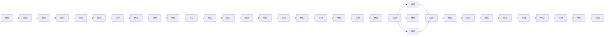

# Campaign Progression — Volume 1 (35 Missions)

Each row = one playable mission mapped to a chapter.  
**Template fields:** Narrative goal · Gameplay goal · Twist · Rewards · Unlocks

---

## Arc 1 — The Summoning (Ch. 1–6)

| Ch | Mission ID | Title | Narrative goal | Gameplay goal | Twist | Rewards | Unlocks |
|----|------------|-------|----------------|---------------|-------|---------|---------|
| 01 | `M01_LOADING` | Loading Screen | Establish isekai + Eternal Player framing | Boot System UI; complete summon sequence | Starter party window = social-combat system | Crystal Gauntlet (bound), Quest log | M02 |
| 02 | `M02_PARTY_SELECT` | Starter Party Selection | Haruto boxed into party pick; factions claim him | Choose starter party; survive flag popups | Factions treat Player as asset; Haruto pushes back | Romance flag tutorial, +Seraphina/Luminara/Veil roster | M03, jealousy meter |
| 03 | `M03_WALK_SD7` | Walk to Sky Dungeon 7 | Travel banter; mixed-faction friction | Escort/travel segment; first skirmish optional | Party functions despite romance-combat nudges | Travel XP, faction rep baseline | M04, east path |
| 04 | `M04_TUTORIAL_LIAR` | Tutorial Dungeon (Liar) | Dungeon language: tiles, rules, traps | Clear tutorial floor; learn tile rules | Dungeon rewards unity, punishes posturing | Tutorial loot, trap codex entry | M05, Sunny tease |
| 05 | `M05_SUNNY_HATES` | Helpful Tutorial That Hates You | Sunny’s help is petty and weaponized | Follow/ignore Sunny tips; survive trap escalation | Haruto resists tutorial framing | Sunny entity unlocked, debuff immunity (1 use) | M06, Sunny overlay |
| 06 | `M06_VEIL_KEY` | Veil Key Problem | Radiant + Veil cooperation mandatory | Obtain Radiant seal + Veil curse-key; co-op door | Haruto refuses faction ownership of keys | Veil Key (party-held), co-op gate tutorial | M07, faction key system |

---

## Arc 2 — Party Formation & Escalation (Ch. 7–10)

| Ch | Mission ID | Title | Narrative goal | Gameplay goal | Twist | Rewards | Unlocks |
|----|------------|-------|----------------|---------------|-------|---------|---------|
| 07 | `M07_SHADOW_DETOUR` | Shadow Detour: Group Hug Hazard | Veil side route; Ecto sincerity | Veil detour puzzle; group-hug hazard room | Bond events = real advantages + liabilities | Ecto bond +1, Veil rep +5 | M08, bond event system |
| 08 | `M08_MINI_BOSS` | Mini Boss Wakes Up | First real boss pressure | Defeat Sunshade Golem (dual phase) | Leadership = coordination + emotional regulation | Mini-boss loot, Level 2 threshold | M09, mini-boss tier |
| 09 | `M09_LOOT_BINDS` | Loot Binds (And So Do People) | Binding loot mirrors relationships | Equip bound gear; manage jealousy spike | Haruto accepts responsibility, not ownership | Bound gear slot, jealousy +10 baseline | M10, loot binding |
| 10 | `M10_COMMANDER` | The Commander Collects | Veil contract pressure | Survive Bone Commander confrontation; refuse contract | Third path: unity without submission | Party code buff, Veil respect | M11, contract refusal flag |

---

## Arc 3 — Sky Dungeon #7 Deep Run (Ch. 11–18)

| Ch | Mission ID | Title | Narrative goal | Gameplay goal | Twist | Rewards | Unlocks |
|----|------------|-------|----------------|---------------|-------|---------|---------|
| 11 | `M11_COOP_GATE` | First Real Co-op Gate | Light+Veil synergy required | Dual-key co-op gate puzzle | Party trusts systems of each other | Co-op gate cleared, synergy buff | M12 |
| 12 | `M12_HATES_TEAMWORK` | Dungeon Hates Teamwork | Dungeon retaliates when unity rises | Survive anti-teamwork room; adapt tactics | Dungeon is adaptive, not scripted | Adaptive dungeon flag, Unity tracker | M13 |
| 13 | `M13_RIVALRY` | Rivalry Mechanic Unlocked | Jealousy aggro = difficulty spikes | Manage jealousy during combat; reduce spawns | Haruto leads social layer | Rivalry mechanic UI, spawn formula active | M14 |
| 14 | `M14_SUNNY_TRAP` | Tutorial Triggers the Trap | Sunny guidance creates problems | Ignore Sunny; survive trap wave | UI/tooltips treated as adversarial | Sunny trust -1, trap immunity (room) | M15 |
| 15 | `M15_BOX_SUNNY` | Put The Tutorial In A Box | Contain Sunny; party chooses autonomy | Box Sunny interactable; escape room | Dungeon reacts — lost control lever | Sunny contained state, dungeon aggro +1 | M16 |
| 16 | `M16_MIRROR_TRIAL` | Unity Trial (Mirror Lies) | Mirror tests bonds; copies attack weakest | Mirror puzzle + copy fight; no separation | Cyan tab unlocks; Watcher attention | Cyan UI tab, Codex fragment 1 | M17 |
| 17 | `M17_VERDANT` | Verdant Interrupt | Elara reframes factions; cuff warning | Meet Elara; survive interrupt corridor | Verdant route activates; Equinox tease | Elara roster, Verdant route flag | M18 |
| 18 | `M18_GOLDEN_TANKARD` | Golden Tankard Victory | Celebration + bound relic aftermath | Hub celebration; equip bound relic (forced) | Public rivalry escalation; Elara warning | Bound relic (Eternal hint), Tankard hub | M19, Golden Tankard hub |

---

## Arc 4 — Politics & Bond Quests (Ch. 19–28)

| Ch | Mission ID | Title | Narrative goal | Gameplay goal | Twist | Rewards | Unlocks |
|----|------------|-------|----------------|---------------|-------|---------|---------|
| 19 | `M19_RADIANT_HEARING` | Radiant Hearing (Anomaly) | Council labels Haruto threat/tool | Hearing scene + dialogue choices | Haruto refuses hero ownership publicly | Radiant rep shift, Seraphina bond event | M20 |
| 20 | `M20_VEIL_CONTRACT` | Veil Offer (Real Contract) | Veil pitches freedom as contract | Negotiation + refuse/subvert contract | Third option: alliance without chains | Veil alliance (non-submission), contract flag | M21 |
| 21 | `M21_GOSSIP_META` | Golden Tankard Gossip Meta | Mira weaponizes rumors | Gossip minigame; shift NPC attitudes | Comedy tools = political tools | Gossip network, betting NPCs tease | M22 |
| 22 | `M22_VELVET_CHECKUP` | Velvet's Checkup (Soft Power) | Healing reveals Velvet's reach | Intimate healing scene + buff | Support roles run the world | Velvet bond +1, healing upgrade | M23 |
| 23 | `M23_BOND_SERAPHINA` | Bond Quest: Seraphina | Replacement fear; training + vulnerability | Training combat + dialogue | Validated as person, not flag | Seraphina co-op combo, bond max tease | M24 |
| 24 | `M24_BOND_LUMINARA` | Bond Quest: Luminara | Spell tutoring; gods publish patch notes | Spell tutorial + lore dump | Protective teasing; marked Player warning | Luminara spell assist, codex: Patch Notes | M25 |
| 25 | `M25_BOND_VEIL` | Bond Quest: Veil Humanity | See Veil civilians; Ecto sincerity | Veil hub exploration + escort | Bridging = moral, not tactical | Veil civilian trust, Ecto bond +2 | M26 |
| 26 | `M26_JEALOUSY_PEAK` | Jealousy Peaks (Town Becomes Dungeon) | Safe zones aren't safe | Town combat with absurd difficulty spikes | System treats romance like combat | Town dungeon flag, jealousy cap event | M27 |
| 27 | `M27_SYSTEM_WARNING` | System Warning (Morale Dangerous) | Direct UI warning; Sunny erratic | Survive correction hints; Elara confirms | World pushes back against unity | Correction Heat +1, Sunny erratic state | M28 |
| 28 | `M28_PUBLIC_CHOICE` | Public Choice Cliffhanger | World boss foreshadow | Public choice scene; refuse both sides | Refusal triggers raid | World boss spawn, raid queue | M29 |

---

## Arc 5 — World Boss Raid (Ch. 29–35)

| Ch | Mission ID | Title | Narrative goal | Gameplay goal | Twist | Rewards | Unlocks |
|----|------------|-------|----------------|---------------|-------|---------|---------|
| 29 | `M29_RAID_PREP` | Raid Prep (Forced Mixed Party) | Prep reveals stakes; sabotage unity | Prep quests: Velvet triage, Mira supplies, Seraphina rally | Hardliners sabotage | Raid buffs, mixed party locked | M30 |
| 30 | `M30_BOSS_P1` | World Boss Phase 1 | Boss punishes disunity | Phase 1: jealousy = literal mechanic | Haruto tanks morale, not damage | Phase 1 clear, morale tank skill | M31 |
| 31 | `M31_BOSS_P2` | World Boss Phase 2 | Light+Veil combo required | Phase 2: Seraphina + Bone Commander sync | Mutual respect overwrites rivalry | Declaration duel combo | M32 |
| 32 | `M32_BOSS_P3` | World Boss Phase 3 | Unity Override capstone | Phase 3: Party Leader Authority new mode | Cyan route pulses; world marks deeper | Unity Override ability, Level 5 | M33 |
| 33 | `M33_AFTERMATH` | Aftermath (Quiet Warmth) | Decompression; real intimacy | Hub scenes; bond payoffs | Elara warns higher-tier response | Bond epilogues, warmth buff | M34 |
| 34 | `M34_LOOT_ETERNAL` | Loot & Consequences | Bound relic hints Eternal Gauntlet | Examine relic; faction reactions | Sunny monitor slip | Eternal Gauntlet codex, faction lock-in | M35 |
| 35 | `M35_PATCH_NOTES` | Post-Credits Patch Notes | Luminos/Umbrax gag = menace | Post-credits scene + codex | Volume 2: Verdant + Correction | Volume 2 hook, credits | End state |

---

## Mission dependency graph (simplified)

**Bond quests (M23–M25):** Available after M22; all three should complete before M26 for full reactivity.

---

## Level band alignment

| Player level | Missions | Capstone |
|--------------|----------|----------|
| 1 | M01–M05 | Tutorial complete |
| 2 | M06–M09 | Mini-boss clear |
| 3 | M10–M13 | Rivalry mechanic |
| 4 | M14–M17 | Cyan tab + Elara |
| 5 | M18–M35 | Unity Override + world boss |

---

## Reactivity flags (save-game)

| Flag | Set by | Affects |
|------|--------|---------|
| `refused_radiant_ownership` | M06, M19 | Council dialogue, hearing outcome |
| `refused_veil_contract` | M10, M20 | Veil offers, Bone Commander respect |
| `sunny_contained` | M15 | Sunny behavior M27+, monitor slip M34 |
| `cyan_tab_unlocked` | M16 | Codex, Verdant UI, Overdrive tease |
| `elara_route_active` | M17 | M18 warning, M33 aftermath |
| `bound_relic_equipped` | M18 | M21 gossip, M26 jealousy, M34 eternal hint |
| `correction_heat` | M27 | Volume 2 spawn rate |
| `unity_override_used` | M32 | End state, faction treatment |
